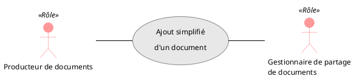
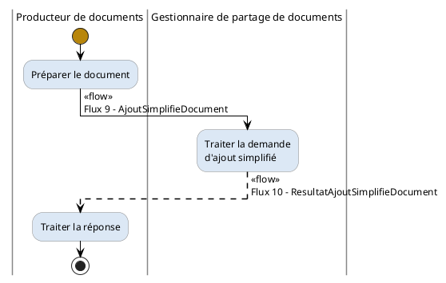
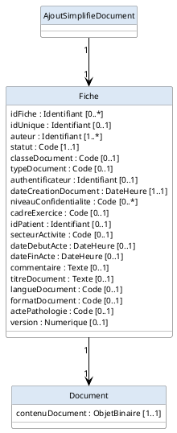

### Définition 

**Figure 16 : Processus collaboratif "Ajout simplifié d'un document"**
 

| **Service attendu** | Le producteur de documents envoie au gestionnaire de partage de documents une demande d'ajout simplifié d'un document. |
| **Pré-conditions** | Le producteur de documents doit au préalable : 1. être en possession du document à ajouter, 2. être habilité |
| **Post-conditions** | N/A |
| **Contraintes fonctionnelles** | N/A |
| **Scénario nominal** | N/A |

**Table 5 Caractéristiques du processus collaboratif**

### Description et identification des flux

**Figure 17 : Processus collaboratif "Ajout simplifié d'un document"**
 

#### Description des actions

| **Action** | **Description** |
| ------ | ------ |
| Préparer le document | Le producteur de documents prépare le document à ajouter dans l'infrastructure de partage de documents. |
| Traiter la réponse | Le producteur de documents reçoit et traite le résultat de la demande d'ajout simplifié du document. Il peut afficher à l'utilisateur le résultat de la demande. |
| Traiter la demande d'ajout simplifié | L'infrastructure de partage de documents traite la demande d'ajout simplifié, exécute les actions nécessaires au traitement de cette demande et retourne le résultat du traitement. |

**Table 14 Tableau des actions**

#### Identification des flux

| **Flux** | **Processus** | **Emetteur** | **Récepteur** | **Périmètre** |
| ------ | ------ | ------ | ------ | ------ |
| Flux 9 - AjoutSimplifieDocument | Ajout simplifié d'un document | Producteur de documents | Gestionnaire de partage de documents | Oui |
| Flux 10 - ResultatAjoutSimplifieDocument | Ajout simplifié d'un document | Gestionnaire de partage de documents | Producteur de documents | Oui |

### Flux 9 - AjoutSimplifieDocument MODELISATION DES FLUX D'INFORMATIONS

**Figure 18 : Flux 9 - AjoutSimplifieDocument**
 

#### Classe "Document"

Un document est la plus petite unité d'information déposée dans l'infrastructure de partage de documents. Dans le cadre de l'ajout simplifié, le contenu du document est directement inclus dans la fiche (et non transmis dans une ressource séparée).

| **Nom** | **Description** |
| ----- | ----- |
| contenuDocument : [1..1] ObjetBinaire | Contient le document au format binaire. |

**Table 30 Attributs de la classe "Document"**

#### Classe "Fiche"
Une fiche représente le document stocké dans l'infrastructure de partage de documents. Elle contient les informations décrivant les caractéristiques principales d'un document servant au classement et à la recherche des documents.

| **Nom** | **Description** |
| ----- | ----- |
| idFiche : [0..*] Identifiant | Identifiant unique d'une fiche d'un document. |
| idUnique : [0..1] Identifiant | Identifiant unique global affecté au document par son créateur. Il est utilisable comme référence externe dans d'autres documents. |
| auteur : [1..*] Identifiant | Identifiant de la personne physique et/ou du dispositif auteur d'un document. |
| statut : [1..1] Code | Représente le statut de la fiche d'un document (valeur fixée à « current »). Nomenclature(s) associée(s) : ** TRE_R269-AvailabilityStatusProvenanceOasis ** TRE_R270-AvailabilityStatus |
| classeDocument : [0..1] Code | Représente la classe du document (compte rendu, imagerie médicale, traitement, certificat, ...). Jeu de valeurs issu de la nomenclature TRE_A03-ClasseDocument |
| typeDocument : [0..1] Code | Représente le type du document. Jeu de valeurs issu des nomenclatures : ** LOINC ** et TRE_A05-TypeDocComplementaire |
| authentificateur : [0..1] Identifiant | Cet attribut représente l'acteur validant le document et prenant la responsabilité du contenu médical de celui-ci. Il peut s'agir de l'auteur du document si celui-ci est une personne et s'il endosse la responsabilité du contenu médical de ses documents. |
| dateCreationDocument : [1..1] DateHeure | Représente la date et l'heure de la création du document. |
| niveauConfidentialite : [0..*] Code | Contient les informations définissant le niveau de confidentialité d'un document. Nomenclatures utilisées : ** TRE_A08-Confidentiality-HL7 ** TRE_A07-StatusVisibiliteDocument ** JDV_J08-XdsConfidentialityCode-CISIS |
| cadreExercice : [0..1] Code | Cadre d'exercice de l'acte qui a engendré la création du document. Nomenclature utilisée : TRE_A01-CadreExercice |
| idPatient : [0..1] Identifiant | Représente l'identifiant du patient. |
| secteurActivite : [0..1] Code | Secteur d'activité lié à la prise en charge de la personne, en lien avec le document produit. Nomenclature utilisée : TRE_R02-SecteurActivite |
| dateDebutActe : [0..1] DateHeure | Représente la période de début de l'acte de référence. |
| dateFinActe : [0..1] DateHeure | Date de fin de l'acte de référence, si connue. |
| commentaire : [0..1] Texte | Commentaire associé au document. |
| titreDocument : [0..1] Texte | Titre du document. |
| langueDocument : [0..1] Code | Langue dans laquelle le document est rédigé. Pour tous les documents produits par les systèmes initiateurs français, le code est "fr-FR". |
| formatDocument : [0..1] Code | Format technique détaillé du document. Nomenclatures utilisées : TRE_A06-FormatCodeComplementaire TRE_A09-DICOMuidRegistry TRE_A10-NomenclatureURN TRE_A11-IheFormatCode ASS_X11-CorresModeleCDA-XdsFormatCode-CISIS ASS_A12-CorresMediaTypeCDANonStructure-XdsFormatCode-CISIS |
| actePathologie : [0..1] Code | Actes et pathologies en rapport avec le document. Nomenclatures utilisées : ** CCAM pour les actes médicaux (OID="1.2.250.1.213.2.5"); ** CIM-10 pour les diagnostics de pathologie (OID="2.16.840.1.113883.6.3"); ** TRE_A00-ProducteurDocNonPS pour les documents d'expression personnelle du patient. |
| version : [0..1] Numerique | Numéro de version de la fiche d'un document. La valeur de la métadonnée version est égale à 1 pour la première version de la fiche. |

**Table 31 Attributs de la classe "Fiche"**

### Flux 10 - ResultatAjoutSimplifieDocument MODELISATION DES FLUX D'INFORMATIONS

```plantuml
@startuml
hide circle
skinparam backgroundColor white
skinparam DefaultFontName Arial
skinparam DefaultFontSize 11
skinparam class {
  BackgroundColor white
  BorderColor #888888
  HeaderBackgroundColor #dce8f5
  ArrowColor #000000
  FontColor #000000
  FontSize 11
}
class ResultatAjoutSimplifieDocument
class Fiche {
  statutAttributFiche : Texte [0..*]
}
ResultatAjoutSimplifieDocument "0..1" --> "*" Fiche
@enduml
```

**Figure 19 : Flux 10 - ResultatAjoutSimplifieDocument**
 

#### Classe "Fiche"

Une fiche représente le document stocké dans l'infrastructure de partage de documents. Elle contient les informations décrivant les caractéristiques principales d'un document servant au classement et à la recherche des documents.

| **Nom** | **Description** |
| ----- | ----- |
| statutAttributFiche : [0..*] Texte | La réponse de la demande d'ajout simplifié d'un document peut contenir une fiche qui contient le statut (réussite ou échec) de chaque attribut renseigné lors de la demande d'ajout. |

**Table 32 Attributs de la classe "Fiche"**
